# Fusion Manage Chromium Extensions

Fusion Manage Chromium Extensions is a Chrome extension that improves day-to-day workflows in Autodesk Fusion Manage.
It adds practical UI actions, filtering tools, and quality-of-life improvements directly inside supported pages.

## Unofficial Project Notice

This project is an independent, custom-built extension for Autodesk Fusion Manage. It is **not** an official Autodesk product and is not supported, endorsed, or maintained by Autodesk. It integrates with Autodesk Fusion Manage through supported web and API interactions.

## Disclaimer

This project is provided **"as is"** without warranties of any kind, express or implied, including but not limited to reliability, accuracy, completeness, or fitness for a particular purpose. Use of this software is at your own discretion and risk.

## Table of Contents

- [What Users Can Do](#what-users-can-do)
- [Supported Pages](#supported-pages)
- [User Guide](#user-guide)
- [Quick Setup (Local)](#quick-setup-local)
- [Useful Commands](#useful-commands)
- [Feature configuration](#feature-configuration)
- [Permissions and Host Scope](#permissions-and-host-scope)
- [Authentication and Privacy](#authentication-and-privacy)
- [Additional Documentation](#additional-documentation)

## What Users Can Do

### 1) Item Details Improvements
- Hide empty fields in view mode for cleaner records.
- Quickly focus on required fields in edit mode.
- Use section visibility helpers to reduce scrolling.
- Access command-bar shortcuts and linked-item navigation helpers.

These item page enhancements are meant to make busy Fusion Manage records easier to read and work with. Instead of forcing users to scan long forms full of empty or low-value fields, the extension helps surface the parts of the page that matter most for the current task. That is especially useful when reviewing dense records, entering data quickly, or moving between related records during everyday support, engineering, or operations workflows.

#### Screenshots

*Click a preview to open the full image in a new tab.*

<table>
<tr>
<td align="center" valign="top" width="50%">
<strong>View mode command bar</strong><br />
<a href="./docs/images/item-details-header-bar-view-mode.png" target="_blank" rel="noopener noreferrer">
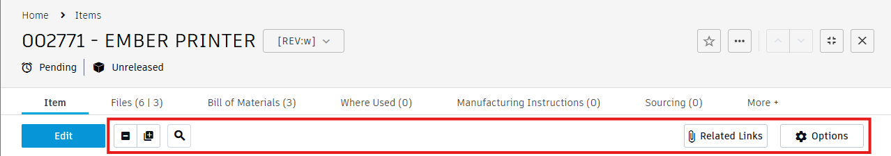
</a><br />
<sub>Options and Related Links in the command bar.</sub>
</td>
<td align="center" valign="top" width="50%">
<strong>Options menu</strong><br />
<a href="./docs/images/item-details-options.png" target="_blank" rel="noopener noreferrer">
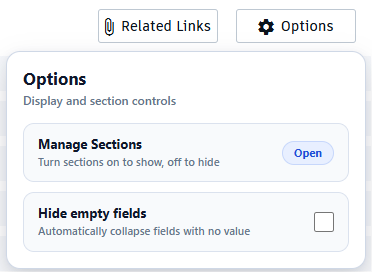
</a><br />
<sub>Hide empty fields and open Manage Sections.</sub>
</td>
</tr>
<tr>
<td align="center" valign="top" width="50%">
<strong>Manage Sections</strong><br />
<a href="./docs/images/item-details-manage-sections.png" target="_blank" rel="noopener noreferrer">
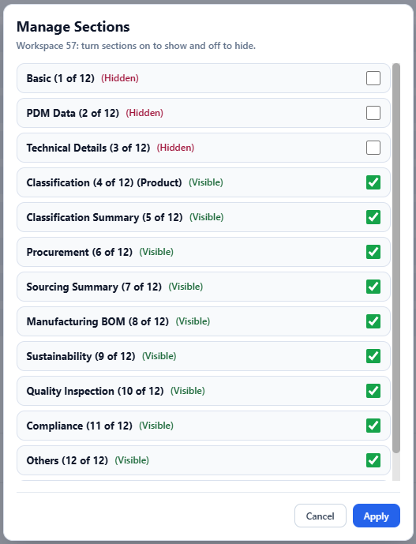
</a><br />
<sub>Show or hide record sections per workspace.</sub>
</td>
<td align="center" valign="top" width="50%">
<strong>Related Links</strong><br />
<a href="./docs/images/item-details-related-links.png" target="_blank" rel="noopener noreferrer">
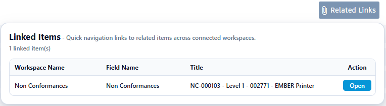
</a><br />
<sub>Jump to linked items from the command bar.</sub>
</td>
</tr>
<tr>
<td align="center" valign="top" width="50%">
<strong>Edit mode command bar</strong><br />
<a href="./docs/images/item-details-header-bar-edit-mode.png" target="_blank" rel="noopener noreferrer">
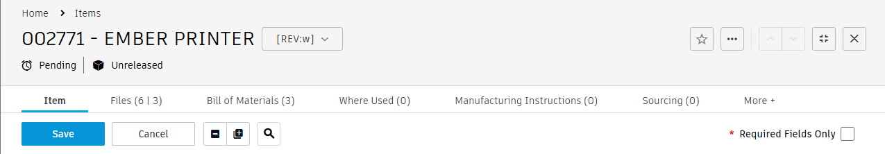
</a><br />
<sub>Required Fields Only filter while editing.</sub>
</td>
<td></td>
</tr>
</table>

### 2) Grid Enhancements
- Build advanced filter conditions for complex table searches.
- Open the Advanced Editor to stage row changes more safely.
- Export visible grid rows to CSV.

The grid tools are designed for large tables where the standard page experience can become slow to review or awkward to edit. Advanced filtering helps narrow results without leaving the page, while the Advanced Editor gives users a safer staging step before committing row changes. CSV export then makes it easy to take the filtered result set outside the system for review, handoff, or audit support.

#### Screenshots

*Click a preview to open the full image in a new tab.*

<table>
<tr>
<td align="center" valign="top" width="50%">
<strong>Grid header</strong><br />
<a href="./docs/images/grid-details-header.png" target="_blank" rel="noopener noreferrer">
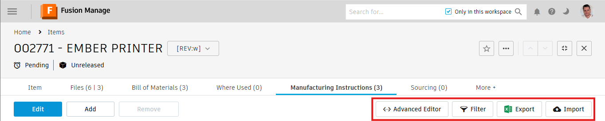
</a><br />
<sub>Filter, editor, and export actions in the grid header.</sub>
</td>
<td align="center" valign="top" width="50%">
<strong>Advanced filtering</strong><br />
<a href="./docs/images/grid-details-filter.png" target="_blank" rel="noopener noreferrer">
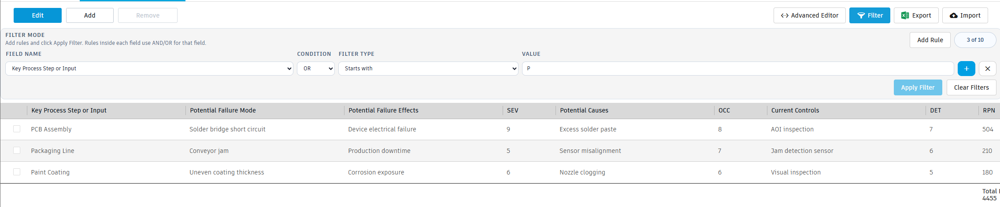
</a><br />
<sub>Build multi-condition searches on the grid.</sub>
</td>
</tr>
<tr>
<td align="center" valign="top" width="50%">
<strong>Advanced Editor</strong><br />
<a href="./docs/images/grid-details-advanced-editor.png" target="_blank" rel="noopener noreferrer">
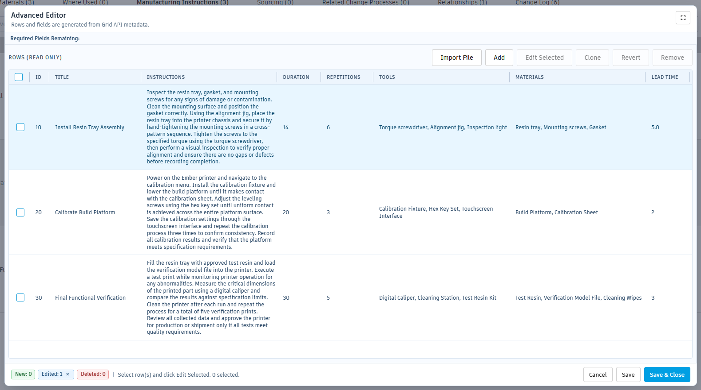
</a><br />
<sub>Review staged row changes before commit.</sub>
</td>
<td align="center" valign="top" width="50%">
<strong>Advanced Editor (edit mode)</strong><br />
<a href="./docs/images/grid-details-advanced-editor-edit-mode.png" target="_blank" rel="noopener noreferrer">
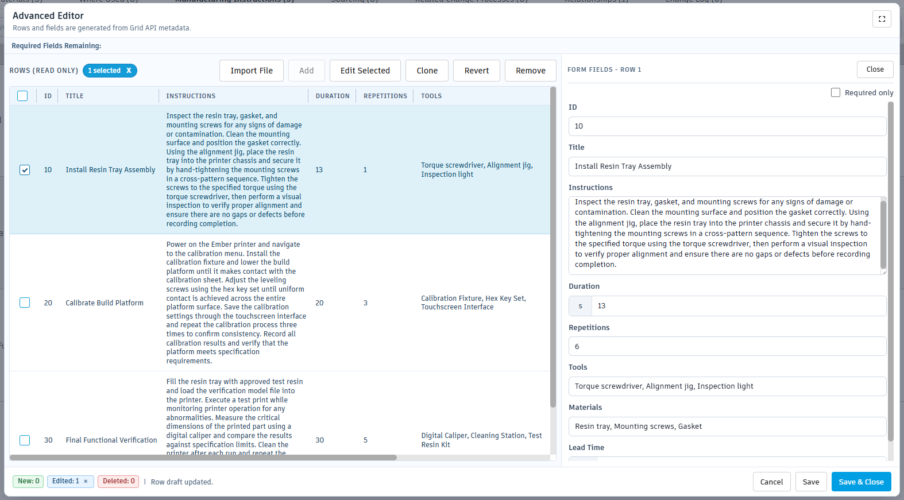
</a><br />
<sub>Inline field editing in the staging grid.</sub>
</td>
</tr>
<tr>
<td align="center" valign="top" width="50%">
<strong>Grid import</strong><br />
<a href="./docs/images/grid-details-import.png" target="_blank" rel="noopener noreferrer">
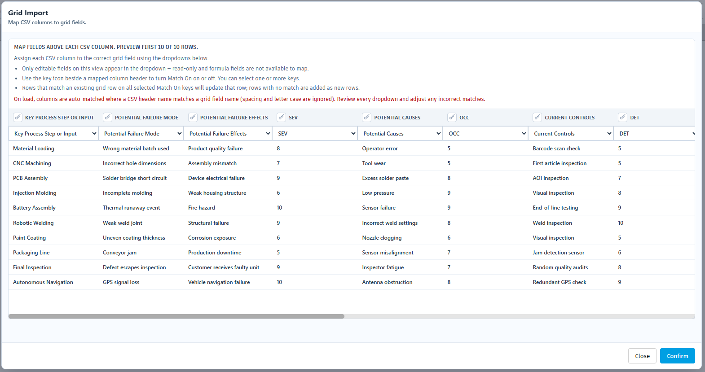
</a><br />
<sub>Map and submit rows from an external file.</sub>
</td>
<td></td>
</tr>
</table>

### 3) BOM Clone Workflow
- Launch Clone from the BOM tab.
- Search and validate a source item.
- Stage add/update/delete actions before committing.
- Review staged counts and commit when ready.

The BOM Clone workflow is built to reduce the effort and risk involved in copying or shaping BOM structures. Instead of jumping between pages and making changes directly against the target structure, users can search for a source, validate what they want to bring across, and review staged actions before committing anything. That makes the workflow easier to reason about, especially when dealing with larger structures or more sensitive manufacturing changes.

[Image Placeholder: Clone BOM search screen]
[Image Placeholder: Clone BOM structure/target staging screen]

### 4) Views (Tableaus) Export, Import & Manage
- Export one or more workspace views to a portable `.plmview` file.
- Import views back into the same or a different tenant — conflict detection automatically flags existing names as overwrite or creates new ones.
- Rename views inline before importing to avoid naming conflicts.
- Manage Views lets you stage and bulk-delete views, with a safeguard that prevents deleting every view.

The views tools are designed for teams that need to copy, migrate, or back up workspace view configurations. Exporting produces a single compressed file that carries all column, filter, and sort settings. Importing into a different tenant automatically rewrites workspace and tenant identifiers so the file remains portable without manual editing. The Manage dialog provides a safe staged-delete workflow so accidental bulk removal is harder to commit.

#### Screenshots

*Click a preview to open the full image in a new tab.*

<table>
<tr>
<td align="center" valign="top" width="50%">
<strong>Views menu</strong><br />
<a href="./docs/images/tableaus-options.png" target="_blank" rel="noopener noreferrer">
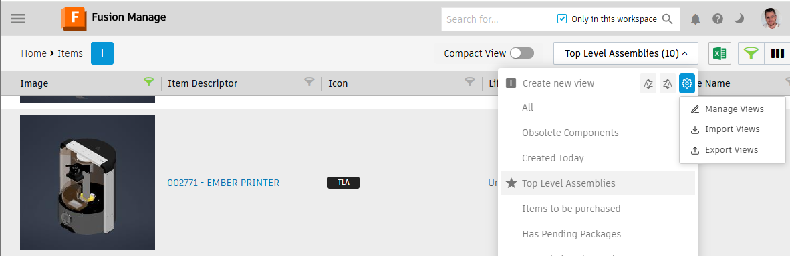
</a><br />
<sub>Entry point for export, import, and manage workflows.</sub>
</td>
<td align="center" valign="top" width="50%">
<strong>Export Views</strong><br />
<a href="./docs/images/tableaus-export-views.png" target="_blank" rel="noopener noreferrer">
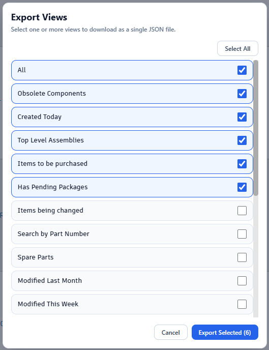
</a><br />
<sub>Select views and download a portable <code>.plmview</code> file.</sub>
</td>
</tr>
<tr>
<td align="center" valign="top" width="50%">
<strong>Import Views</strong><br />
<a href="./docs/images/tableaus-import-views.png" target="_blank" rel="noopener noreferrer">
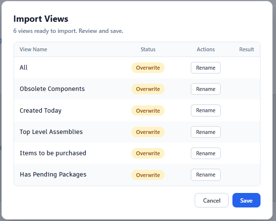
</a><br />
<sub>Resolve New / Overwrite conflicts before saving.</sub>
</td>
<td align="center" valign="top" width="50%">
<strong>Manage Views</strong><br />
<a href="./docs/images/tableaus-manage-views.png" target="_blank" rel="noopener noreferrer">
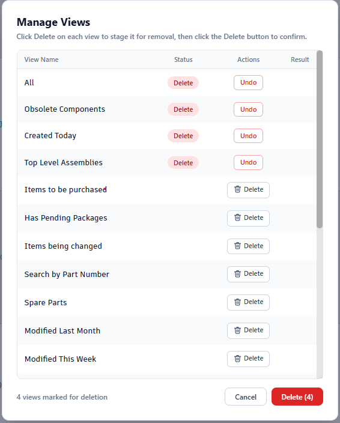
</a><br />
<sub>Stage deletions and review results before confirming.</sub>
</td>
</tr>
</table>

### 5) Design Components (Components workspace)

> **⚠️ Premium paid-tier APIs — usage may incur charges**
>
> This feature uses **Autodesk Platform Services (APS)** Model Derivative APIs. Conversions beyond your monthly APS allowance may be billed at Autodesk's published rates.
>
> Review [APS product details and pricing](https://www.autodesk.com/products/autodesk-platform-services/product-details) before enabling `enableDesignComponents` in `features.js`.

- Open conversion tooling from supported **item** pages in the **Components** (CW_COMPONENTS) design workspace—the extension only activates when the workspace API resolves to that system name.
- Run format conversion workflows backed by Autodesk Platform Services / Model Derivative-style APIs, with progress surfaced in a modal; use the control in the item header icon row.
- Requires a valid Fusion Manage session and compatible page markup. The lazy bundle is not shipped or loaded when `enableDesignComponents` is `false` at build time (see `features.js`).

Design Components targets teams working in the dedicated Components workspace: it adds a focused entry point for derivative and conversion tasks next to native item chrome, instead of leaving users to hunt through unrelated menus.

**Credit:** **YJ Yoo** was the original developer of the Components (Design Components) feature—thank you for the idea and groundwork.

#### Screenshots

*Click a preview to open the full image in a new tab.*

<table>
<tr>
<td align="center" valign="top" width="50%">
<strong>Item header conversion control</strong><br />
<a href="./docs/images/model-derivative-header.png" target="_blank" rel="noopener noreferrer">
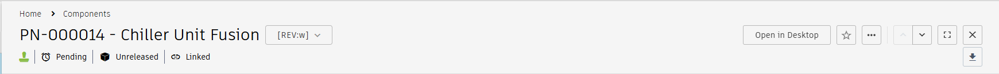
</a><br />
<sub>Conversion entry point in the Components workspace item header.</sub>
</td>
<td align="center" valign="top" width="50%">
<strong>Conversion modal</strong><br />
<a href="./docs/images/model-derivative-conversion.png" target="_blank" rel="noopener noreferrer">
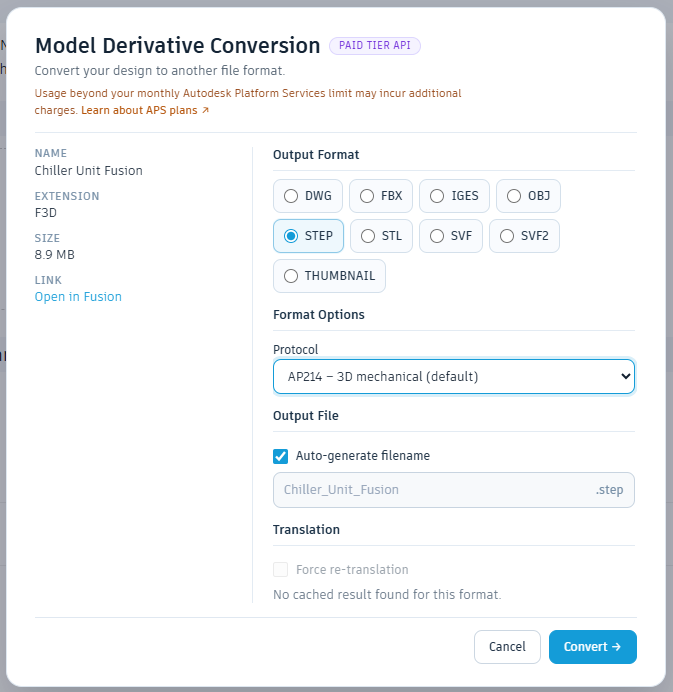
</a><br />
<sub>Pick an output format and run the Model Derivative conversion workflow.</sub>
</td>
</tr>
</table>

## Supported Pages

- Item details and add-item pages
- Grid pages
- BOM pages (Clone workflow)
- Views (Tableaus) management pages
- Design (Components / CW_COMPONENTS) workspace item pages (when enabled in `features.js`)

## User Guide

The extension loads automatically on supported Fusion Manage pages and augments the existing UI without replacing the native page. Availability still depends on the current page layout, workspace permissions, and the active Fusion Manage browser session.

### Item Details

- Hide Empty Fields reduces visual noise on supported read-only layouts by collapsing empty structure without changing record data.
- Required Only helps surface mandatory inputs during editing so long forms are easier to review and complete.
- Search helpers and linked-item actions reduce page-to-page friction on supported item details and add-item flows.
- These helpers only activate where the page structure matches supported layouts.

### Grid

- Advanced Filters help narrow large result sets directly in the current grid view.
- Advanced Editor supports staged add, edit, clone, revert, and remove workflows so changes can be reviewed before commit.
- CSV Export downloads the currently visible rows after filtering.
- Some actions are permission-gated, so available controls can differ by workspace and user.

### BOM Clone

- BOM Clone starts with source item search and validation before loading the heavier staging workflow.
- The engineering flow focuses on source-to-target BOM comparison, staged row edits, and optional add-existing/linkable item actions.
- The manufacturing flow adds process-oriented placement, split behavior, and staged process detail editing where supported.
- Users should always review staged changes, permissions, and required-field blockers before commit.

### Views (Tableaus)

- A gear icon is injected into the views-switcher header on supported item list and split-view pages.
- **Manage Views** opens a dialog listing all workspace views. Click Delete on any row to stage it for removal, then confirm with the Delete button. At least one view must remain — the Delete button is blocked if all views are staged.
- **Import Views** accepts a `.plmview` file. Each view is shown in a table with a New or Overwrite status pill. Use Rename to resolve conflicts before saving. A progress bar tracks each API call and results are shown per row with an error tooltip on failure.
- **Export Views** opens a multi-select dialog. Select one or more views, click Export Selected, and a single compressed `.plmview` file is downloaded. The file is portable across tenants — workspace and tenant identifiers are replaced with placeholders automatically.
- If any API call fails with an auth error, the dialog will prompt you to refresh the page and try again.

### Support Boundaries

- This is an independent extension, not an Autodesk product.
- It is not supported or maintained by Autodesk.
- Not every custom tenant layout or view is guaranteed to be supported.
- Use it at your own discretion and review staged mutations carefully before commit.

## Quick Setup (Local)

If you want to try the extension locally in Chrome, follow these steps.
You do not need to publish anything first, but you do need Node.js installed on your computer.

### Before You Start

- Install **Node.js**.
  The simplest option is the current LTS version from `https://nodejs.org/`.
- Make sure this project is downloaded to your computer.
- Open a terminal in the project folder.

If you are not used to command-line tools, that just means opening PowerShell, Command Prompt, or Terminal in the folder that contains this `README.md`.

### Step 1: Install Project Dependencies

Run:

```bash
npm install
```

What this does:
- Downloads the libraries and build tools the extension needs.
- You usually only need to do this once, unless dependencies change.

### Step 2: Build the Extension

Run:

```bash
npm run build
```

What this does:
- Creates a production-ready build of the extension.
- Puts the final files into the `dist/` folder.

When the build finishes successfully, `dist/` is the folder you will load into Chrome.

### Step 3: Load the Extension in Chrome

1. Open Chrome.
2. Go to `chrome://extensions`.
3. Turn on **Developer mode** using the toggle in the top-right corner.
4. Click **Load unpacked**.
5. Select the `dist/` folder from this project.

After that, the extension should appear in your extensions list and be available on supported Fusion Manage pages.

### Step 4: Use and Refresh It

- Open a supported Autodesk Fusion Manage page.
- The extension activates automatically where supported.
- If you change the code later, run `npm run build` again.
- Then go back to `chrome://extensions` and click the refresh/reload icon for the extension.

### If Something Does Not Work

- Make sure `npm run build` finished without errors.
- Make sure you selected the `dist/` folder, not the project root folder.
- If Chrome still shows an older version, reload the extension from `chrome://extensions`.
- If Fusion Manage was already open, refresh that browser tab after reloading the extension.

### Fast Summary

```bash
npm install
npm run build
```

Then:
1. Open `chrome://extensions`
2. Enable **Developer mode**
3. Click **Load unpacked**
4. Choose `dist/`

## Useful Commands

- `npm run dev` - Start development workflow
- `npm run build` - Build extension assets into `dist/`
- `npm run build:help` - Show production build usage (`--features=`, output hints)
- `npm run check:boundaries` - Run architecture boundary checks
- `npm run preview` - Preview built assets

## Feature configuration

Build-time feature flags live in **`features.js`** at the repository root. The file must `export default` a plain object with the same keys as the template in this repo (so tooling can compare profiles). Values are **booleans** read at **build** and **dev server** startup, then injected into the app as compile-time constants (`src/build/featureFlags.ts`).

### Alternate profiles

Point the build (or Vitest) at another module with the same shape:

```bash
npm run build -- --features=./features.customer-a.js
```

Paths are resolved from the project root. The file must be `.js` or `.mjs`.

### Top-level flags

| Key | Meaning |
| --- | --- |
| `enableItemDetails` | Item details / add-item lazy bundle (`content/item-pages/item-details.js`) |
| `grid` | Nested object; see below. At least one sub-flag must be `true` to emit/load the grid lazy bundle (`content/item-pages/grid.js`). |
| `bom` | Nested object; see below. At least one sub-flag must be `true` to emit/load the BOM lazy bundle (`content/item-pages/bom.js`). |
| `enableTableaus` | Tableaus / views lazy bundle |
| `enableDesignComponents` | Design workspace lazy bundle (premium APS; [product details and rates](https://www.autodesk.com/products/autodesk-platform-services/product-details)) |

### Nested `grid`

| Sub-key | Meaning |
| --- | --- |
| `filters` | Filter panel, rules, apply/clear, row visibility |
| `advancedEditor` | Advanced grid editor (lazy-loaded) |
| `export` | CSV export for the grid (indexes rows; can be enabled without `filters`) |

Each `grid.*` switch is independent at build time and in the popup (subject to what the build shipped).

### Nested `bom`

| Sub-key | Meaning |
| --- | --- |
| `variant` | Variant / engineering BOM clone flow |
| `manufacturing` | Manufacturing BOM clone flow |
| `advancedDownload` | Advanced attachment download UI |

### What happens in a production build

`node scripts/build.mjs` loads flags via `scripts/loadFeatureFlags.mjs`, which **flattens** nested `grid` / `bom` into names such as `enableGridFilters`, `enableBomVariant`, and so on for Vite `define` and the TypeScript `FeatureFlags` type.

When a lazy page bundle is fully off (for example every `grid.*` is `false`):

- That entry is **not** added to the Rollup `input`, so the corresponding `content/item-pages/*.js` file is not produced for that build.
- `scripts/patchDistManifest.mjs` trims `web_accessible_resources` so the manifest only lists lazy scripts that actually exist.

In local **`npm run dev`**, the same profile applies unless you pass `--features=`; disabled areas still compile as `false` branches rather than being removed from the graph.

### Where to look in code

- `features.js` — canonical defaults and comments
- `scripts/loadFeatureFlags.mjs` — `normalizeFeaturesExport`, `--features=` resolution
- `scripts/lazyPageBundleGates.mjs` — shared predicates for which lazy bundles the build emits and the manifest exposes
- `src/build/featureFlags.ts` — runtime `FEATURES` object and helpers such as `isGridPageFeatureEnabled` / `isBomPageFeatureEnabled`

### Build output and CLI

- **Before Vite runs**, the build prints a short plan: which features file is in use and whether each lazy bundle (`grid.js`, `bom.js`, etc.) is **included** or **skipped**, so you know what you are shipping before waiting on the compiler.
- **After a successful build**, `dist/BUILD-PROFILE.txt` lists the same summary plus every normalized boolean flag and a UTC timestamp. You can keep that file next to a `dist/` zip for admins or testers who do not run Node.
- **Help:** `npm run build -- --help` (or `npm run build:help`) shows usage, defaults, and a pointer to this section.

### Per-browser toggles (extension popup)

Open the extension **popup**: a single **Features** list shows every capability. Each row reflects what is **shipped in this build** (`features.js`) and whether it is **on for this Chrome profile** (toggle + saved extension settings). **Reset browser overrides** clears stored overrides.

- Runtime toggles **cannot** turn on code that was omitted from the build (toggle disabled, footnote explains).
## Permissions and Host Scope

From `public/manifest.json`:

- Permissions: `activeTab`, `storage`
- Host permissions:
  - `https://*.autodeskplm360.net/plm/*`
  - `https://*.autodeskplm360.net/admin*`

## Sign-in, storage, and privacy

### Sign-in

- Sign in **only on Fusion Manage** in the browser. The extension has **no separate login** and does not collect your password.
- Features use your **existing Fusion Manage session** on supported pages. If you are signed out or your session expires, sign in on the site as usual.

### Storage

- The extension requests the **`storage`** permission to keep **settings** (for example popup feature toggles and item-details UI preferences).
- It does **not** store your password, read OAuth tokens from Fusion Manage page storage, or persist sign-in credentials for later use. API access uses your live browser session cookies on Autodesk hosts.

### Privacy

- See [`PRIVACY.md`](./PRIVACY.md) for full disclosure text suitable for the Chrome Web Store.